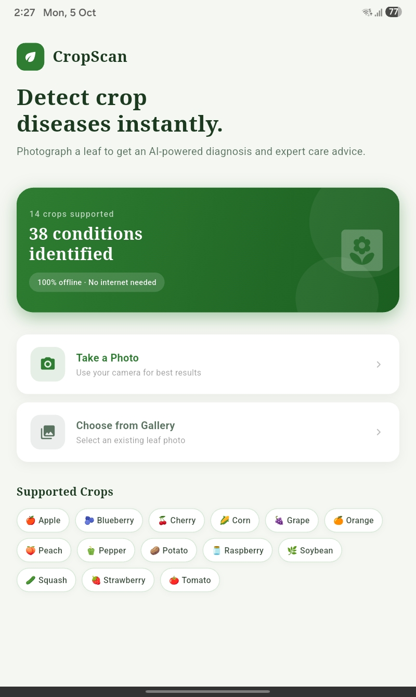
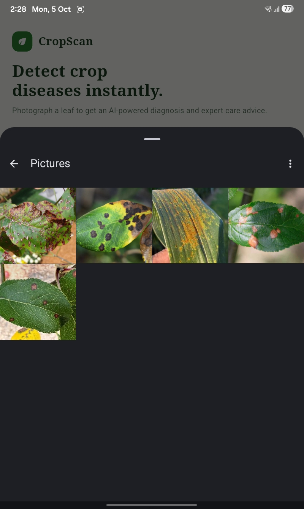
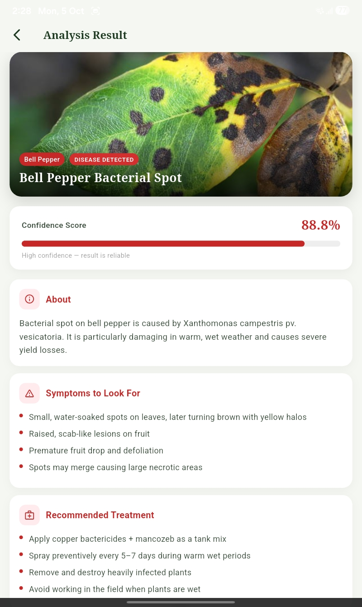
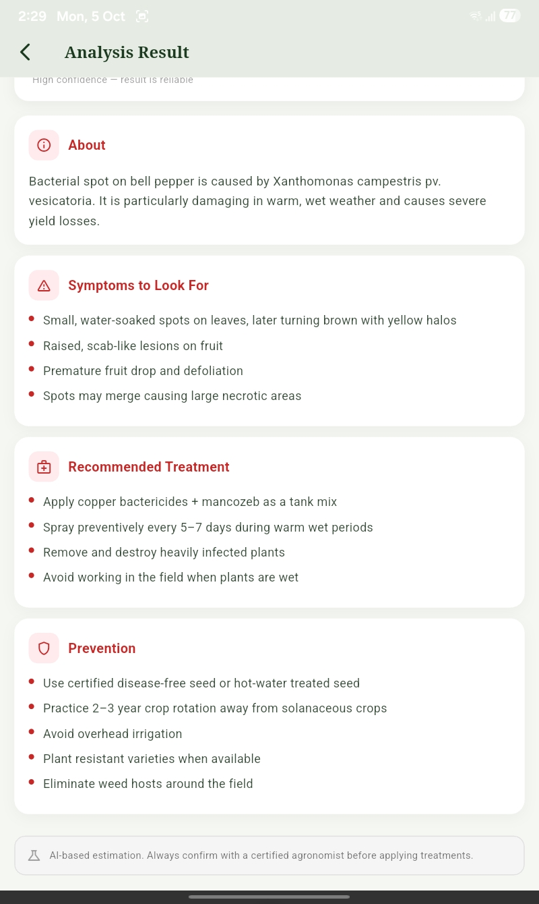
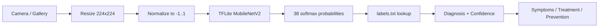

# CropScan

Mobile-First Crop Disease Detection using Quantized CNNs. Offline Android app that diagnoses crop diseases from a leaf photo using an on-device MobileNetV2 model (TensorFlow Lite).

[Screenshots](#screenshots) · [Features](#features) · [Tech Stack](#tech-stack) · [Quick Start](#quick-start) · [How It Works](#how-it-works) · [Dataset](#dataset) · [Training](#training) · [Results](#results) · [Structure](#project-structure) · [Limitations](#limitations) · [Roadmap](#roadmap)

---

## Screenshots

<table>
  <tr>
    <td align="center"><br/><sub>Home</sub></td>
    <td align="center"><br/><sub>Select image</sub></td>
    <td align="center"><br/><sub>Diagnosis</sub></td>
    <td align="center"><br/><sub>Treatment & prevention</sub></td>
  </tr>
</table>

---

## Features

<details open>
<summary><b>Overview</b></summary>

- Camera capture or gallery selection
- Fully offline on-device inference (~180–220 ms on mid-range Android)
- 38 classes across 14 crops
- Confidence indicator: green > 85%, orange 60–85%, red < 60%
- Results: description, symptoms, treatment, prevention
- No network calls; no data leaves the device
- 2.4 MB quantized model embedded in the APK

</details>

<details>
<summary><b>Supported crops</b></summary>

Apple, Blueberry, Cherry, Corn (Maize), Grape, Orange, Peach, Bell Pepper, Potato, Raspberry, Soybean, Squash, Strawberry, Tomato.

</details>

---

## Tech Stack

| Layer | Tools |
|---|---|
| Training | Python 3.12, TensorFlow/Keras, Kaggle (2× Tesla T4, `MirroredStrategy`) |
| Model | MobileNetV2 (ImageNet, frozen) → GlobalAveragePooling2D → Dropout(0.3) → Dense(38, softmax) |
| Conversion | TFLite, dynamic-range quantization (`tf.lite.Optimize.DEFAULT`) |
| App | Flutter 3.x / Dart, `tflite_flutter`, `image_picker` |

---

## Quick Start

<details open>
<summary><b>Run the app</b></summary>

Prerequisites: Flutter SDK 3.x, Android device or emulator.

```bash
git clone <repo-url>
cd CropScan
flutter pub get
flutter run
```

Release APK:

```bash
flutter build apk --release
```

</details>

<details>
<summary><b>Reproduce the model</b></summary>

1. Open the training notebook on Kaggle with GPU (2× T4) enabled.
2. Add the New Plant Diseases Dataset (Augmented) as input.
3. Run all cells; outputs `best_model.h5`, `model.tflite`, `labels.txt` in `/kaggle/working/`.
4. Copy `model.tflite` and `labels.txt` into `assets/` and declare them in `pubspec.yaml`.

</details>

---

## How It Works



---

## Dataset

[New Plant Diseases Dataset (Augmented)](https://www.kaggle.com/datasets/vipoooool/new-plant-diseases-dataset) (Kaggle), derived from PlantVillage.

| Split | Images |
|---|---|
| Train | 70,295 |
| Validation | 17,572 |
| Classes | 38 |

Input: 224 × 224 RGB, normalized with MobileNetV2 `preprocess_input` (range [−1, 1]).

---

## Training

<details>
<summary><b>Hyperparameters</b></summary>

| Parameter | Value |
|---|---|
| Batch size | 64 per GPU (128 global) |
| Optimizer | Adam, lr = 1e-3 |
| Loss | Sparse categorical cross-entropy |
| Max epochs | 20 |
| Callbacks | EarlyStopping (val_loss, patience 3, restore best), ModelCheckpoint (val_accuracy) |
| Augmentation | RandomFlip (H+V), RandomRotation(0.2), RandomZoom(0.1) |
| Training time | ~82 min |

</details>

<details>
<summary><b>Epoch log</b></summary>

| Epoch | Train Acc | Val Loss | Val Acc |
|---|---|---|---|
| 1 | 80.12% | 0.4103 | 87.54% |
| 3 | 90.67% | 0.2741 | 91.48% |
| 6 | 92.97% | 0.2198 | 92.89% |
| **9 (best)** | 93.68% | 0.1978 | **93.60%** |
| 12 | 94.12% | 0.2401 | 92.88% |

Early stopping triggered at epoch 12; epoch 9 weights restored.

</details>

---

## Results

| Metric | Value |
|---|---|
| Validation accuracy (Keras) | 93.60% |
| Validation accuracy (TFLite) | ~93.21% (estimated) |
| Model size | 8.9 MB → 2.4 MB (~73% smaller) |
| Inference time | ~180–220 ms end-to-end |

<details>
<summary><b>Qualitative tests on real-world images</b></summary>

| Condition | Confidence | Note |
|---|---|---|
| Tomato Healthy | 96.1% | Clean image, correct |
| Corn Common Rust | 88.4% | Distinctive pustules |
| Apple Cedar Rust | 84.5% | Distinctive orange lesions |
| Potato Late Blight | 79.2% | Correct on field and lab images |
| Tomato Late Blight | 72.3% | Correct, field image |
| Grape Black Rot | 61.7% | Overlaps with leaf blight |
| Squash Powdery Mildew | 53.4% | Distant shot, shadows |
| Tomato Yellow Leaf Curl | 47.3% | Resembles other yellowing conditions |

</details>

---

## Project Structure

```
CropScan/
├── notebook/            # Kaggle training notebook
├── screenshots/         # README images
├── assets/
│   ├── model.tflite     # Quantized model
│   └── labels.txt       # Class index → label (Crop___Condition)
├── lib/                 # Flutter / Dart source
├── pubspec.yaml
└── README.md
```

---

## Limitations

<details>
<summary><b>Known limitations</b></summary>

- Trained on controlled PlantVillage images; accuracy drops on noisy field photos
- No rice or wheat support
- Softmax confidence is uncalibrated
- No out-of-distribution (non-leaf) detection
- No user feedback mechanism
- Post-quantization accuracy is estimated, not re-evaluated on the full validation set

</details>

---

## Roadmap

- [x] MobileNetV2 transfer learning on PlantVillage
- [x] TFLite dynamic-range quantization
- [x] Offline Flutter app with structured results
- [ ] Field-condition data (PlantDoc, iPlant)
- [ ] Rice and wheat support
- [ ] Progressive fine-tuning of upper backbone layers
- [ ] Colour-jitter augmentation and confidence calibration
- [ ] Leaf / non-leaf detection
- [ ] Scan history and user feedback
- [ ] Regional language support
- [ ] Camera framing guidance overlay

---

Dataset: PlantVillage (Hughes & Salathé, 2015).
